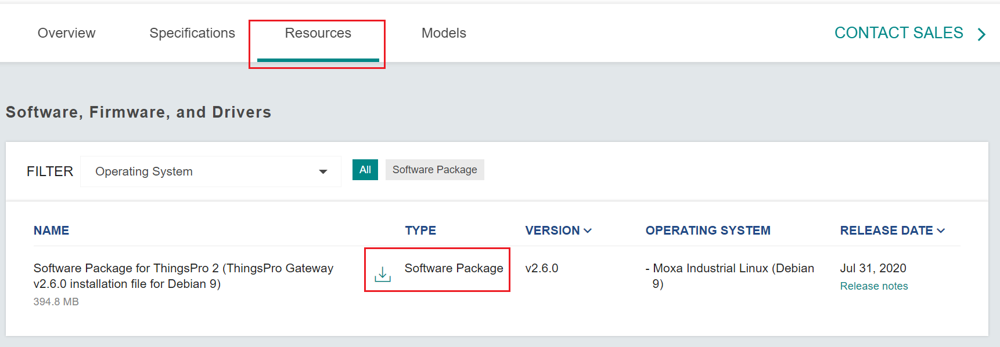

# Moxa Installation Script

Automatically deploy IIoT applications on eligible Moxa IIoT gateways.  

Getting started:

1. Download and Install Latest Release of ThingsPro Gateway Software
2. Sign up for TeamViewer IoT Account
3. Prepare Maintenance PC and Setup Connection to Moxa Gateway 
4. Adapt the config.json file to your needs
5. Run installation-script via Command Line 

## 1. Download and Install Latest Release of ThingsPro Gateway Software

https://www.moxa.com/en/products/industrial-computing/system-software/thingspro-2#resources

* Download TPG
   

* Installation Manual
   

## 2. Sign up for TeamViewer IoT Account

https://login.teamviewer.com/LogOn/PopUp/iot?returnUrl=%2Foauth2%2Fauthorize%2Fiot%3Fresponse_type%3Dcode%26client_id%3D273101-ovKMAJvfeVohIs2s0ZM2%26redirect_uri%3Dhttps%253a%252f%252fapi.teamviewer-iot.com%253a443%252fcallback%26state%3DMTYwNzUxNzU3NDM2OHxodHRwczovL3RlYW12aWV3ZXItaW90LmNvbQ%253d%253d%26display%3Dpopup#register

> Note: Two devices are free  

## 3. Prepare Maintenance PC and Setup Connection to Moxa Gateway  

* Install TeamViewer Client
 https://www.teamviewer.com/en/teamviewer-automatic-download/?t=1607517749218
 
* Install Python3 
https://www.python.org/downloads/release/python-379/

* Install Python Dependencies
  Open command line and run the following command
  
  - pip3 install paramiko
  - pip3 install colorlog

* Connect Maintenance PC LAN Port to Moxa Gateway LAN Port 1 or 2
  Gateway default IP: 
  - LAN 1: 192.168.3.127/24
  - LAN 2: 192.168.4.127/24
                      
  Configure your PC IP address on same local network
  

## 4. Adapt the config.json File to your needs

## 5. Run installation-script via Command Line
  
    - python3 installer_main.py
    The tool will use default config.json file, if not provided explicitly
      
> Note: This command do the following steps: 
- Create ssh connection to Moxa gateway 
- Upload teamviewer-iot-agent and collect_tv_info.sh to the gateway home directory when using the default remote_dir parameter in config file
- Execute shell command to install TeamViewer on moxa device and wait for 3 minutes until software is installed and services are running. 
  > Note: The install_time is approximate time we have calculated for TeamViewer installer. 
  
- [Optional] After 3 minutes tool will check if TeamViewer IoT token is provided in the config file. The tool will initiate another command to assign device 
  to your TeamViewer IoT account and activate the file transfer feature automatically on the fly. On successfull assignment, your device will come online 
  to your account. Now you are ready to access your IoT devices remotely. 
 > Note: The pre-requisite for this is Internet access, and assignment token which you get from your TeamViewer IoT account (website)
  
- Now tool will use command_post to delete installer (software) to free up the disk space
> Note: You can disable the flag "enable_post_installation":false, in the config file if you don't want to delete the packages.

- If "enable_checker": true, flag is True in config file the tool will check the software quality to verify the TeamViewer package is installed correctly or not. 
  On successfull installation, the checker will return output as shown below. Otherwise, it raises an error message.
  
### Enable optional features
- For detail log, use -v argument to enable debug mode
  - python3 installer_main.py -v 2
  
- To use differnet configuration file, use -c argument   
  - python3 installer_main.py -c "config-tv-testing.json" -v 2 
  
- For help 
  - python3 installer_main.py -h 
